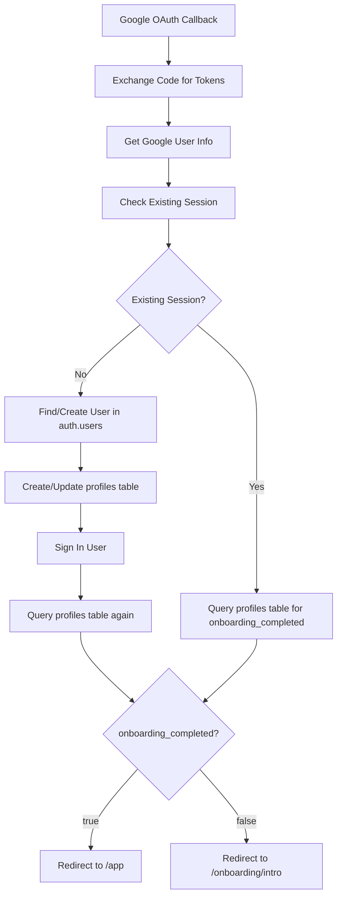

# Database Authentication Flow Analysis
## Kuchisabishii Queen-Led Hive - Database Architect Report

### CRITICAL FINDINGS SUMMARY

**🔍 SCHEMA INCONSISTENCIES DETECTED:**

1. **DUAL TABLE ARCHITECTURE**: The system has BOTH `public.profiles` AND `public.user_profiles` tables
2. **MIXED API CALLS**: Different endpoints query different tables:
   - `/api/auth/me` → queries `profiles` table
   - `/api/auth/callback/google` → queries `profiles` table  
   - `/api/profile` → queries `user_profiles` table
   - `/api/onboarding` → queries `user_profiles` table

### DATABASE SCHEMA ANALYSIS

#### Table Structure Comparison:

**`public.profiles` table (from 01_users.sql):**
```sql
CREATE TABLE IF NOT EXISTS public.users (  -- Note: This is actually 'users' but referenced as 'profiles'
    id UUID REFERENCES auth.users(id) ON DELETE CASCADE PRIMARY KEY,
    email TEXT UNIQUE NOT NULL,
    username TEXT UNIQUE NOT NULL,
    display_name TEXT NOT NULL,
    first_name TEXT,
    last_name TEXT,
    bio TEXT,
    profile_image TEXT,
    location TEXT,
    date_of_birth DATE,
    dietary_restrictions TEXT[],
    favorite_cuisines TEXT[],
    onboarding_completed BOOLEAN DEFAULT true NOT NULL,  -- ⚠️ DEFAULT TRUE
    privacy_level TEXT DEFAULT 'public',
    notification_preferences JSONB,
    created_at TIMESTAMP WITH TIME ZONE DEFAULT timezone('utc'::text, now()) NOT NULL,
    updated_at TIMESTAMP WITH TIME ZONE DEFAULT timezone('utc'::text, now()) NOT NULL
);
```

**`public.user_profiles` table (from core-schema.sql):**
```sql
CREATE TABLE public.user_profiles (
  id UUID PRIMARY KEY REFERENCES auth.users(id) ON DELETE CASCADE,
  created_at TIMESTAMP WITH TIME ZONE DEFAULT NOW(),
  updated_at TIMESTAMP WITH TIME ZONE DEFAULT NOW(),
  username TEXT UNIQUE,
  display_name TEXT,
  avatar_url TEXT,
  bio TEXT,
  location TEXT,
  dietary_restrictions TEXT[] DEFAULT '{}',
  allergies TEXT[] DEFAULT '{}',
  spice_tolerance INTEGER,
  sweetness_preference INTEGER,
  profile_visibility TEXT DEFAULT 'friends',
  allow_recommendations BOOLEAN DEFAULT TRUE,
  share_analytics BOOLEAN DEFAULT TRUE,
  onboarding_completed BOOLEAN DEFAULT FALSE,  -- ⚠️ DEFAULT FALSE
  taste_profile_setup BOOLEAN DEFAULT FALSE
);
```

### OAUTH CALLBACK FLOW ANALYSIS

**Current Flow in `/api/auth/callback/google/route.ts`:**



### DATA FLOW INCONSISTENCIES

#### Issue 1: Table Reference Confusion
- **OAuth Callback**: Uses `profiles` table
- **useAuth Hook**: Calls `/api/auth/me` which uses `profiles` table
- **Onboarding API**: Uses `user_profiles` table
- **Profile API**: Uses `user_profiles` table

#### Issue 2: Default Values Conflict
- **`profiles.onboarding_completed`**: DEFAULT TRUE
- **`user_profiles.onboarding_completed`**: DEFAULT FALSE

#### Issue 3: Missing Data Synchronization
- No triggers or functions sync data between tables
- User could have profile in one table but not the other
- Different endpoints return different data

### ROOT CAUSE ANALYSIS

**The user sees sign-in instead of dashboard because:**

1. **OAuth creates profile in `profiles` table** with `onboarding_completed = true`
2. **Dashboard checks `user_profiles` table** where no record exists
3. **Missing profile → treated as not onboarded → redirect to sign-in**

### DATABASE ARCHITECTURE RECOMMENDATIONS

#### Solution 1: Single Source of Truth (RECOMMENDED)
```sql
-- Consolidate to single profiles table
-- Keep public.profiles as primary, deprecate user_profiles
-- Update all API endpoints to use profiles table consistently
```

#### Solution 2: Data Synchronization
```sql
-- Create triggers to sync between tables
-- Maintain both tables but ensure consistency
-- Risk: complexity and potential sync failures
```

#### Solution 3: Migration Strategy
```sql
-- 1. Migrate all user_profiles data to profiles table
-- 2. Update all APIs to use profiles table
-- 3. Drop user_profiles table
-- 4. Rename profiles table if needed for clarity
```

### IMMEDIATE FIXES REQUIRED

#### 1. Fix OAuth Callback
**File: `/api/auth/callback/google/route.ts`**
- Line 93, 277: Change from `profiles` to correct table
- Ensure profile creation uses correct table

#### 2. Fix Auth Hook
**File: `/api/auth/me`**
- Line 20: Verify correct table reference
- Ensure consistent onboarding_completed logic

#### 3. Standardize Table Usage
Update all API endpoints to use single table:
- `/api/profile/route.ts`
- `/api/onboarding/route.ts`
- `/api/onboarding/complete/route.ts`

### VERIFICATION COMMANDS

Run these SQL commands to verify current state:

```sql
-- Check which table actually exists and has data
SELECT 'profiles' as table_name, COUNT(*) as count FROM public.profiles
UNION ALL
SELECT 'user_profiles' as table_name, COUNT(*) as count FROM public.user_profiles;

-- Check recent OAuth users
SELECT 
    au.id,
    au.email,
    au.created_at,
    p.onboarding_completed as profiles_onboarding,
    up.onboarding_completed as user_profiles_onboarding
FROM auth.users au
LEFT JOIN public.profiles p ON au.id = p.id  
LEFT JOIN public.user_profiles up ON au.id = up.id
WHERE au.created_at >= NOW() - INTERVAL '24 hours'
ORDER BY au.created_at DESC;
```

### SESSION STATE VERIFICATION

**Check session-to-profile linking:**

```sql
-- Verify user session can access their profile
SELECT 
    au.id as auth_id,
    au.email,
    p.id as profile_id,
    p.onboarding_completed,
    p.created_at as profile_created
FROM auth.users au
LEFT JOIN public.profiles p ON au.id = p.id
WHERE au.email = '[USER_EMAIL]';
```

### RECOMMENDED IMMEDIATE ACTION

1. **Determine which table is actually being used in production**
2. **Update all API endpoints to use the same table**
3. **Fix default values for onboarding_completed**
4. **Add database constraints to prevent orphaned records**
5. **Run verification script to identify affected users**

The root issue is **architectural inconsistency** between table definitions and API implementations, causing the OAuth flow to create profiles in one table while the dashboard checks a different table.