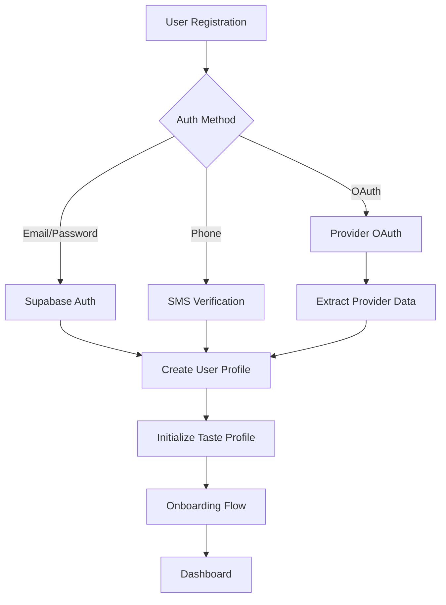

# Kuchisabishii - Comprehensive Technical Architecture Plan

## Executive Summary

This document provides a comprehensive technical architecture plan for Kuchisabishii, addressing all advanced feature requirements including authentication systems, backend tenancy, Google Maps integration, AI recommendations, social features, and data management strategies. The architecture builds upon the existing emotional food journaling foundation while introducing scalable enterprise-grade capabilities.

## 1. Authentication System Architecture

### 1.1 Multi-Provider Authentication Strategy

#### Primary Authentication Providers
```typescript
interface AuthenticationProviders {
  supabase_native: {
    email_password: boolean;
    magic_links: boolean;
    phone_auth: boolean;
  };
  oauth_providers: {
    google: {
      web_client_id: string;
      android_client_id: string;
      ios_client_id: string;
      scopes: ['openid', 'profile', 'email'];
    };
    apple: {
      service_id: string;
      team_id: string;
      key_id: string;
      scopes: ['name', 'email'];
    };
    facebook: {
      app_id: string;
      scopes: ['email', 'public_profile'];
    };
  };
}
```

#### Authentication Flow Architecture


### 1.2 Enhanced User Profile System

#### Extended User Schema
```sql
-- Enhanced user profiles with comprehensive data
CREATE TABLE public.enhanced_user_profiles (
  id UUID PRIMARY KEY REFERENCES auth.users(id) ON DELETE CASCADE,
  
  -- Basic Information
  username TEXT UNIQUE NOT NULL,
  display_name TEXT,
  avatar_url TEXT,
  bio TEXT,
  birth_date DATE,
  gender TEXT CHECK (gender IN ('male', 'female', 'non_binary', 'prefer_not_to_say')),
  
  -- Contact & Location
  phone_number TEXT,
  primary_location JSONB, -- {city, state, country, coordinates}
  timezone TEXT DEFAULT 'UTC',
  
  -- Cultural Background
  cultural_background TEXT[],
  languages_spoken TEXT[],
  dietary_philosophy TEXT, -- 'health_focused', 'pleasure_first', 'balanced', etc.
  
  -- Privacy & Preferences
  profile_visibility TEXT DEFAULT 'friends' CHECK (profile_visibility IN ('public', 'friends', 'private')),
  allow_friend_requests BOOLEAN DEFAULT TRUE,
  allow_recommendations_sharing BOOLEAN DEFAULT TRUE,
  data_sharing_consent BOOLEAN DEFAULT FALSE,
  marketing_consent BOOLEAN DEFAULT FALSE,
  
  -- Verification Status
  email_verified BOOLEAN DEFAULT FALSE,
  phone_verified BOOLEAN DEFAULT FALSE,
  identity_verified BOOLEAN DEFAULT FALSE,
  restaurant_owner BOOLEAN DEFAULT FALSE,
  
  -- Engagement Stats
  total_experiences INTEGER DEFAULT 0,
  total_friends INTEGER DEFAULT 0,
  reputation_score INTEGER DEFAULT 0,
  trust_score DECIMAL(3,2) DEFAULT 0.5,
  
  -- Timestamps
  created_at TIMESTAMP WITH TIME ZONE DEFAULT NOW(),
  updated_at TIMESTAMP WITH TIME ZONE DEFAULT NOW(),
  last_active_at TIMESTAMP WITH TIME ZONE DEFAULT NOW(),
  onboarding_completed_at TIMESTAMP WITH TIME ZONE
);
```

#### Password Security & Recovery
```typescript
interface PasswordSecurity {
  requirements: {
    min_length: 8;
    require_uppercase: boolean;
    require_lowercase: boolean;
    require_numbers: boolean;
    require_symbols: boolean;
    prevent_common_passwords: boolean;
  };
  recovery: {
    email_reset: boolean;
    security_questions: boolean;
    sms_backup: boolean;
    recovery_codes: boolean;
  };
  security: {
    two_factor_auth: boolean;
    session_management: boolean;
    device_tracking: boolean;
    suspicious_activity_detection: boolean;
  };
}
```

## 2. Backend Architecture for Multi-Tenancy & Public Testing

### 2.1 Data Tenancy Strategy

#### Tenant Isolation Architecture
```sql
-- Tenant management system
CREATE TABLE public.tenants (
  id UUID PRIMARY KEY DEFAULT uuid_generate_v4(),
  name TEXT NOT NULL,
  type TEXT CHECK (type IN ('production', 'testing', 'development', 'enterprise')) DEFAULT 'production',
  status TEXT CHECK (status IN ('active', 'suspended', 'archived')) DEFAULT 'active',
  
  -- Configuration
  settings JSONB DEFAULT '{}',
  feature_flags JSONB DEFAULT '{}',
  data_retention_days INTEGER DEFAULT 365,
  
  -- Limits
  max_users INTEGER DEFAULT 1000000,
  max_storage_gb INTEGER DEFAULT 1000,
  api_rate_limit INTEGER DEFAULT 10000,
  
  created_at TIMESTAMP WITH TIME ZONE DEFAULT NOW(),
  updated_at TIMESTAMP WITH TIME ZONE DEFAULT NOW()
);

-- User tenant associations
CREATE TABLE public.user_tenants (
  id UUID PRIMARY KEY DEFAULT uuid_generate_v4(),
  user_id UUID REFERENCES auth.users(id) ON DELETE CASCADE,
  tenant_id UUID REFERENCES public.tenants(id) ON DELETE CASCADE,
  role TEXT CHECK (role IN ('user', 'admin', 'owner')) DEFAULT 'user',
  status TEXT CHECK (status IN ('active', 'inactive', 'banned')) DEFAULT 'active',
  joined_at TIMESTAMP WITH TIME ZONE DEFAULT NOW(),
  
  UNIQUE(user_id, tenant_id)
);
```

#### Row-Level Security with Tenant Isolation
```sql
-- Enhanced RLS for tenant isolation
CREATE POLICY tenant_isolation_policy ON public.food_experiences
  FOR ALL
  TO authenticated
  USING (
    EXISTS (
      SELECT 1 FROM public.user_tenants ut
      WHERE ut.user_id = auth.uid()
      AND ut.tenant_id = (
        SELECT up.tenant_id FROM public.user_profiles up 
        WHERE up.id = food_experiences.user_id
      )
      AND ut.status = 'active'
    )
  );
```

### 2.2 Public Testing Environment

#### Testing Infrastructure
```typescript
interface TestingEnvironment {
  public_demo: {
    anonymous_access: boolean;
    sample_data_seed: boolean;
    feature_limitations: string[];
    session_duration: number; // minutes
    auto_cleanup: boolean;
  };
  
  user_testing: {
    invitation_codes: boolean;
    limited_feature_access: boolean;
    feedback_collection: boolean;
    usage_analytics: boolean;
  };
  
  data_management: {
    automatic_cleanup: boolean;
    cleanup_schedule: string; // cron expression
    data_anonymization: boolean;
    export_capabilities: boolean;
  };
}
```

#### Demo Data Seeding Strategy
```sql
-- Demo data seeding system
CREATE TABLE public.demo_datasets (
  id UUID PRIMARY KEY DEFAULT uuid_generate_v4(),
  name TEXT NOT NULL,
  description TEXT,
  tenant_id UUID REFERENCES public.tenants(id),
  data_size TEXT CHECK (data_size IN ('small', 'medium', 'large')),
  includes_media BOOLEAN DEFAULT TRUE,
  
  -- Content configuration
  user_count INTEGER DEFAULT 10,
  restaurant_count INTEGER DEFAULT 50,
  experience_count INTEGER DEFAULT 200,
  
  created_at TIMESTAMP WITH TIME ZONE DEFAULT NOW()
);
```

## 3. Google Maps API Integration Architecture

### 3.1 Comprehensive Maps Integration

#### Google Maps Services Integration
```typescript
interface GoogleMapsIntegration {
  places_api: {
    restaurant_search: {
      text_search: boolean;
      nearby_search: boolean;
      place_details: boolean;
      place_photos: boolean;
      place_reviews: boolean;
    };
    autocomplete: {
      establishment_types: ['restaurant', 'meal_takeaway', 'meal_delivery'];
      location_bias: boolean;
      session_tokens: boolean;
    };
  };
  
  geocoding: {
    address_to_coordinates: boolean;
    reverse_geocoding: boolean;
    component_restrictions: boolean;
  };
  
  distance_matrix: {
    travel_time_calculation: boolean;
    multiple_destinations: boolean;
    traffic_data: boolean;
  };
  
  static_maps: {
    restaurant_location_thumbnails: boolean;
    custom_markers: boolean;
    styled_maps: boolean;
  };
}
```

#### Enhanced Restaurant Discovery
```sql
-- Enhanced restaurant schema with Google Places integration
CREATE TABLE public.restaurants_enhanced (
  id UUID PRIMARY KEY DEFAULT uuid_generate_v4(),
  
  -- Google Places Integration
  google_place_id TEXT UNIQUE,
  google_data JSONB, -- Cached Google Places data
  google_rating DECIMAL(2,1),
  google_review_count INTEGER,
  google_price_level INTEGER,
  google_photos TEXT[],
  
  -- Enhanced Location Data
  formatted_address TEXT,
  address_components JSONB,
  coordinates GEOGRAPHY(POINT, 4326),
  viewport JSONB, -- Northeast/Southwest bounds
  plus_code TEXT,
  
  -- Business Information
  name TEXT NOT NULL,
  business_status TEXT,
  permanently_closed BOOLEAN DEFAULT FALSE,
  opening_hours JSONB,
  special_hours JSONB, -- Holiday hours, etc.
  phone_number TEXT,
  international_phone_number TEXT,
  website TEXT,
  
  -- Classification
  types TEXT[], -- Google Place types
  cuisine_types TEXT[],
  establishment_type TEXT,
  
  -- Features & Amenities
  accessibility JSONB,
  amenities JSONB,
  payment_options JSONB,
  dining_options JSONB, -- delivery, takeout, dine_in
  
  -- Verification & Quality
  verified_by_google BOOLEAN DEFAULT FALSE,
  claimed_by_owner UUID REFERENCES public.enhanced_user_profiles(id),
  verification_status TEXT DEFAULT 'unverified',
  
  -- Cache Management
  google_data_last_updated TIMESTAMP WITH TIME ZONE,
  cache_expiry TIMESTAMP WITH TIME ZONE,
  
  created_at TIMESTAMP WITH TIME ZONE DEFAULT NOW(),
  updated_at TIMESTAMP WITH TIME ZONE DEFAULT NOW()
);

-- Spatial indexes for efficient location queries
CREATE INDEX idx_restaurants_coordinates ON public.restaurants_enhanced USING GIST(coordinates);
CREATE INDEX idx_restaurants_google_place ON public.restaurants_enhanced(google_place_id);
```

### 3.2 Location Services Architecture

#### Geospatial Query Functions
```sql
-- Advanced location-based queries
CREATE OR REPLACE FUNCTION find_restaurants_near_location(
  search_lat DECIMAL,
  search_lng DECIMAL,
  radius_meters INTEGER DEFAULT 5000,
  cuisine_filter TEXT[] DEFAULT NULL,
  price_range INTEGER[] DEFAULT NULL,
  min_rating DECIMAL DEFAULT 0.0,
  limit_results INTEGER DEFAULT 20
)
RETURNS TABLE (
  restaurant_id UUID,
  name TEXT,
  distance_meters INTEGER,
  google_rating DECIMAL,
  cuisine_types TEXT[],
  price_level INTEGER,
  formatted_address TEXT,
  coordinates JSONB
) AS $$
BEGIN
  RETURN QUERY
  SELECT 
    r.id,
    r.name,
    ST_Distance(r.coordinates, ST_Point(search_lng, search_lat)::geography)::INTEGER AS distance,
    r.google_rating,
    r.cuisine_types,
    r.google_price_level,
    r.formatted_address,
    ST_AsGeoJSON(r.coordinates)::JSONB
  FROM public.restaurants_enhanced r
  WHERE 
    ST_DWithin(r.coordinates, ST_Point(search_lng, search_lat)::geography, radius_meters)
    AND (cuisine_filter IS NULL OR r.cuisine_types && cuisine_filter)
    AND (price_range IS NULL OR r.google_price_level = ANY(price_range))
    AND r.google_rating >= min_rating
    AND r.business_status = 'OPERATIONAL'
  ORDER BY distance
  LIMIT limit_results;
END;
$$ LANGUAGE plpgsql;
```

## 4. Menu Data Seeding from Google APIs

### 4.1 Automated Menu Data Collection

#### Google Places Menu Integration
```typescript
interface MenuDataSeeding {
  collection_strategy: {
    google_places_photos: {
      menu_photo_identification: boolean;
      ocr_text_extraction: boolean;
      structured_data_parsing: boolean;
    };
    
    web_scraping: {
      restaurant_websites: boolean;
      delivery_platforms: boolean;
      social_media: boolean;
      rate_limiting: boolean;
    };
    
    crowd_sourcing: {
      user_contributions: boolean;
      photo_menu_uploads: boolean;
      manual_entry_incentives: boolean;
      verification_workflow: boolean;
    };
  };
  
  data_processing: {
    nlp_menu_parsing: boolean;
    price_extraction: boolean;
    dietary_tag_detection: boolean;
    cuisine_classification: boolean;
    duplicate_detection: boolean;
  };
}
```

#### Menu Data Schema
```sql
-- Comprehensive menu system
CREATE TABLE public.menu_categories (
  id UUID PRIMARY KEY DEFAULT uuid_generate_v4(),
  restaurant_id UUID REFERENCES public.restaurants_enhanced(id) ON DELETE CASCADE,
  name TEXT NOT NULL,
  description TEXT,
  display_order INTEGER,
  is_active BOOLEAN DEFAULT TRUE,
  
  created_at TIMESTAMP WITH TIME ZONE DEFAULT NOW()
);

CREATE TABLE public.menu_items_enhanced (
  id UUID PRIMARY KEY DEFAULT uuid_generate_v4(),
  restaurant_id UUID REFERENCES public.restaurants_enhanced(id) ON DELETE CASCADE,
  category_id UUID REFERENCES public.menu_categories(id),
  
  -- Basic Information
  name TEXT NOT NULL,
  description TEXT,
  price DECIMAL(10, 2),
  currency TEXT DEFAULT 'USD',
  
  -- Classification
  item_type TEXT, -- appetizer, main, dessert, beverage
  cuisine_style TEXT,
  cooking_method TEXT[],
  
  -- Dietary Information
  dietary_tags JSONB, -- vegan, gluten_free, etc.
  allergens TEXT[],
  spice_level INTEGER CHECK (spice_level BETWEEN 0 AND 5),
  
  -- Nutritional Data (when available)
  nutrition_facts JSONB,
  calorie_estimate INTEGER,
  portion_size TEXT,
  
  -- Media & Presentation
  images TEXT[],
  preparation_time_minutes INTEGER,
  
  -- Availability
  is_available BOOLEAN DEFAULT TRUE,
  seasonal BOOLEAN DEFAULT FALSE,
  availability_schedule JSONB,
  
  -- Data Sources
  data_source TEXT, -- 'google_places', 'manual', 'scraped', 'user_contributed'
  source_confidence DECIMAL(3, 2),
  verified_by_restaurant BOOLEAN DEFAULT FALSE,
  
  -- Popularity & Recommendations
  popularity_score DECIMAL(3, 2) DEFAULT 0.5,
  recommendation_count INTEGER DEFAULT 0,
  
  created_at TIMESTAMP WITH TIME ZONE DEFAULT NOW(),
  updated_at TIMESTAMP WITH TIME ZONE DEFAULT NOW()
);

-- Menu item variants (size options, customizations)
CREATE TABLE public.menu_item_variants (
  id UUID PRIMARY KEY DEFAULT uuid_generate_v4(),
  menu_item_id UUID REFERENCES public.menu_items_enhanced(id) ON DELETE CASCADE,
  
  variant_type TEXT, -- 'size', 'customization', 'style'
  name TEXT NOT NULL,
  description TEXT,
  price_adjustment DECIMAL(8, 2) DEFAULT 0,
  
  created_at TIMESTAMP WITH TIME ZONE DEFAULT NOW()
);
```

### 4.2 Data Quality & Verification System

#### Menu Data Quality Assurance
```sql
-- Menu data quality tracking
CREATE TABLE public.menu_data_quality (
  id UUID PRIMARY KEY DEFAULT uuid_generate_v4(),
  restaurant_id UUID REFERENCES public.restaurants_enhanced(id),
  
  -- Quality Metrics
  completeness_score DECIMAL(3, 2), -- 0.0 to 1.0
  accuracy_score DECIMAL(3, 2),
  freshness_score DECIMAL(3, 2),
  
  -- Data Sources
  google_places_data BOOLEAN DEFAULT FALSE,
  website_scraped_data BOOLEAN DEFAULT FALSE,
  user_contributed_data BOOLEAN DEFAULT FALSE,
  restaurant_verified_data BOOLEAN DEFAULT FALSE,
  
  -- Quality Indicators
  has_prices BOOLEAN DEFAULT FALSE,
  has_descriptions BOOLEAN DEFAULT FALSE,
  has_dietary_info BOOLEAN DEFAULT FALSE,
  has_images BOOLEAN DEFAULT FALSE,
  
  last_updated TIMESTAMP WITH TIME ZONE DEFAULT NOW(),
  next_update_due TIMESTAMP WITH TIME ZONE
);
```

## 5. Comprehensive Food Review System

### 5.1 Advanced Review Architecture

#### Multi-Dimensional Review System
```sql
-- Enhanced food experience with comprehensive metadata
CREATE TABLE public.comprehensive_food_experiences (
  id UUID PRIMARY KEY DEFAULT uuid_generate_v4(),
  user_id UUID REFERENCES public.enhanced_user_profiles(id) ON DELETE CASCADE,
  restaurant_id UUID REFERENCES public.restaurants_enhanced(id),
  menu_item_id UUID REFERENCES public.menu_items_enhanced(id),
  
  -- Basic Experience Data
  dish_name TEXT NOT NULL,
  custom_description TEXT,
  overall_rating INTEGER CHECK (overall_rating BETWEEN 1 AND 5),
  
  -- Temporal Context
  experienced_at TIMESTAMP WITH TIME ZONE DEFAULT NOW(),
  meal_type TEXT CHECK (meal_type IN ('breakfast', 'brunch', 'lunch', 'dinner', 'snack', 'dessert', 'late_night')),
  dining_context TEXT CHECK (dining_context IN ('dine_in', 'takeout', 'delivery', 'homemade', 'catered')),
  
  -- Detailed Sensory Analysis
  taste_profile JSONB, -- {salty: 8, sweet: 3, sour: 2, bitter: 1, umami: 7, spicy: 4}
  texture_analysis JSONB, -- {crunch: 6, creaminess: 8, chewiness: 4, temperature: 9}
  aroma_profile JSONB, -- {intensity: 8, descriptors: ["garlic", "herbs", "smoky"]}
  visual_presentation JSONB, -- {appeal: 8, color_vibrancy: 7, plating_creativity: 6}
  
  -- Emotional Response System
  pre_meal_emotions TEXT[],
  post_meal_emotions TEXT[],
  emotional_intensity INTEGER CHECK (emotional_intensity BETWEEN 1 AND 10),
  mood_impact TEXT CHECK (mood_impact IN ('very_negative', 'negative', 'neutral', 'positive', 'very_positive')),
  nostalgia_factor INTEGER CHECK (nostalgia_factor BETWEEN 0 AND 10),
  comfort_level INTEGER CHECK (comfort_level BETWEEN 1 AND 10),
  
  -- Social & Environmental Context
  dining_companions INTEGER DEFAULT 0,
  companion_types TEXT[], -- family, friends, colleagues, romantic_partner, strangers
  special_occasion TEXT,
  weather_context TEXT,
  dining_duration_minutes INTEGER,
  
  -- Economic Context
  amount_spent DECIMAL(10, 2),
  currency TEXT DEFAULT 'USD',
  value_perception TEXT CHECK (value_perception IN ('overpriced', 'expensive', 'fair', 'good_value', 'excellent_value')),
  would_pay_again BOOLEAN,
  
  -- Repeat Behavior
  previous_experience BOOLEAN DEFAULT FALSE,
  comparison_to_previous TEXT, -- better, same, worse
  likelihood_to_reorder INTEGER CHECK (likelihood_to_reorder BETWEEN 1 AND 10),
  craving_frequency TEXT CHECK (craving_frequency IN ('never', 'rarely', 'occasionally', 'often', 'constantly')),
  
  -- Media & Memory
  photos TEXT[],
  videos TEXT[],
  voice_notes TEXT[],
  memory_triggers TEXT[], -- smell, sound, visual cues that might trigger memory
  
  -- Health & Dietary Impact
  dietary_goals_alignment INTEGER CHECK (dietary_goals_alignment BETWEEN 1 AND 10),
  digestive_comfort INTEGER CHECK (digestive_comfort BETWEEN 1 AND 10),
  energy_impact TEXT CHECK (energy_impact IN ('draining', 'neutral', 'energizing')),
  
  -- Privacy & Sharing
  visibility TEXT DEFAULT 'friends' CHECK (visibility IN ('private', 'friends', 'public')),
  shareable_with_restaurant BOOLEAN DEFAULT FALSE,
  allow_in_recommendations BOOLEAN DEFAULT TRUE,
  
  -- Metadata
  created_at TIMESTAMP WITH TIME ZONE DEFAULT NOW(),
  updated_at TIMESTAMP WITH TIME ZONE DEFAULT NOW()
);
```

### 5.2 Advanced Metadata Tracking

#### Experience Context Enrichment
```sql
-- Environmental context tracking
CREATE TABLE public.experience_environmental_context (
  id UUID PRIMARY KEY DEFAULT uuid_generate_v4(),
  food_experience_id UUID REFERENCES public.comprehensive_food_experiences(id) ON DELETE CASCADE,
  
  -- Location Context
  dining_location JSONB, -- coordinates, venue type, ambiance
  seating_area TEXT, -- indoor, outdoor, bar, private_room
  noise_level INTEGER CHECK (noise_level BETWEEN 1 AND 5),
  lighting_quality INTEGER CHECK (lighting_quality BETWEEN 1 AND 5),
  
  -- Service Context
  service_speed INTEGER CHECK (service_speed BETWEEN 1 AND 5),
  staff_friendliness INTEGER CHECK (staff_friendliness BETWEEN 1 AND 5),
  service_attentiveness INTEGER CHECK (service_attentiveness BETWEEN 1 AND 5),
  
  -- Timing Context
  wait_time_minutes INTEGER,
  rush_hour BOOLEAN DEFAULT FALSE,
  peak_dining_time BOOLEAN DEFAULT FALSE,
  
  created_at TIMESTAMP WITH TIME ZONE DEFAULT NOW()
);

-- Cultural and dietary context
CREATE TABLE public.experience_cultural_context (
  id UUID PRIMARY KEY DEFAULT uuid_generate_v4(),
  food_experience_id UUID REFERENCES public.comprehensive_food_experiences(id) ON DELETE CASCADE,
  
  -- Cultural Elements
  cuisine_authenticity INTEGER CHECK (cuisine_authenticity BETWEEN 1 AND 10),
  cultural_significance TEXT,
  fusion_elements TEXT[],
  traditional_preparation BOOLEAN DEFAULT FALSE,
  
  -- Dietary Context
  dietary_accommodation_quality INTEGER CHECK (dietary_accommodation_quality BETWEEN 1 AND 5),
  ingredient_substitutions TEXT[],
  allergen_safety INTEGER CHECK (allergen_safety BETWEEN 1 AND 5),
  
  created_at TIMESTAMP WITH TIME ZONE DEFAULT NOW()
);
```

## 6. Versioned "Eat Again" Functionality

### 6.1 Experience Evolution Tracking

#### Versioned Experience System
```sql
-- Versioned experience tracking
CREATE TABLE public.experience_versions (
  id UUID PRIMARY KEY DEFAULT uuid_generate_v4(),
  base_experience_id UUID REFERENCES public.comprehensive_food_experiences(id),
  user_id UUID REFERENCES public.enhanced_user_profiles(id) ON DELETE CASCADE,
  restaurant_id UUID REFERENCES public.restaurants_enhanced(id),
  menu_item_id UUID REFERENCES public.menu_items_enhanced(id),
  
  -- Version Information
  version_number INTEGER NOT NULL DEFAULT 1,
  version_type TEXT CHECK (version_type IN ('repeat_visit', 'seasonal_variation', 'recipe_change', 'preparation_difference')),
  
  -- Comparison Data
  rating_change INTEGER, -- difference from previous version
  taste_evolution JSONB, -- changes in taste profile
  satisfaction_change INTEGER, -- difference in satisfaction
  
  -- Notes & Observations
  changes_noticed TEXT,
  consistency_rating INTEGER CHECK (consistency_rating BETWEEN 1 AND 10),
  improvement_suggestions TEXT,
  
  -- Reference to Previous Version
  previous_version_id UUID REFERENCES public.experience_versions(id),
  
  -- Full Experience Data (denormalized for performance)
  experience_snapshot JSONB, -- Complete experience data at this version
  
  created_at TIMESTAMP WITH TIME ZONE DEFAULT NOW()
);

-- Version comparison analytics
CREATE TABLE public.experience_evolution_analytics (
  id UUID PRIMARY KEY DEFAULT uuid_generate_v4(),
  base_experience_id UUID REFERENCES public.comprehensive_food_experiences(id),
  user_id UUID REFERENCES public.enhanced_user_profiles(id) ON DELETE CASCADE,
  
  -- Evolution Metrics
  total_versions INTEGER DEFAULT 1,
  rating_trend TEXT, -- improving, declining, stable
  consistency_score DECIMAL(3, 2),
  
  -- Pattern Detection
  seasonal_patterns JSONB,
  preference_evolution JSONB,
  quality_trends JSONB,
  
  -- Predictive Insights
  next_visit_prediction TIMESTAMP WITH TIME ZONE,
  satisfaction_prediction DECIMAL(3, 2),
  
  last_analyzed TIMESTAMP WITH TIME ZONE DEFAULT NOW()
);
```

### 6.2 Smart "Eat Again" Recommendations

#### Intelligent Repeat Experience System
```typescript
interface EatAgainIntelligence {
  recommendation_triggers: {
    time_based: {
      seasonal_craving: boolean;
      anniversary_reminders: boolean;
      similar_weather_conditions: boolean;
      time_since_last_visit: boolean;
    };
    
    mood_based: {
      emotional_state_matching: boolean;
      comfort_food_detection: boolean;
      celebration_occasions: boolean;
      stress_relief_patterns: boolean;
    };
    
    context_based: {
      similar_dining_situations: boolean;
      companion_matching: boolean;
      location_proximity: boolean;
      budget_alignment: boolean;
    };
  };
  
  version_tracking: {
    consistency_monitoring: boolean;
    quality_change_detection: boolean;
    menu_evolution_tracking: boolean;
    user_preference_evolution: boolean;
  };
}
```

## 7. Social Features Architecture

### 7.1 Advanced Friend System

#### Enhanced Social Connections
```sql
-- Enhanced friendship system with trust and compatibility
CREATE TABLE public.enhanced_friendships (
  id UUID PRIMARY KEY DEFAULT uuid_generate_v4(),
  requester_id UUID REFERENCES public.enhanced_user_profiles(id) ON DELETE CASCADE,
  addressee_id UUID REFERENCES public.enhanced_user_profiles(id) ON DELETE CASCADE,
  
  -- Relationship Details
  status TEXT CHECK (status IN ('pending', 'accepted', 'declined', 'blocked', 'unfriended')) DEFAULT 'pending',
  relationship_type TEXT CHECK (relationship_type IN ('friend', 'family', 'colleague', 'taste_twin', 'foodie_friend')),
  
  -- Trust & Compatibility Metrics
  trust_score DECIMAL(3, 2) DEFAULT 0.5,
  taste_compatibility_score DECIMAL(3, 2),
  recommendation_accuracy DECIMAL(3, 2),
  
  -- Interaction History
  total_interactions INTEGER DEFAULT 0,
  shared_experiences INTEGER DEFAULT 0,
  successful_recommendations INTEGER DEFAULT 0,
  
  -- Privacy Settings
  sharing_permissions JSONB DEFAULT '{"experiences": true, "recommendations": true, "location": false}',
  notification_preferences JSONB DEFAULT '{"new_experiences": true, "recommendations": true}',
  
  -- Timestamps
  created_at TIMESTAMP WITH TIME ZONE DEFAULT NOW(),
  updated_at TIMESTAMP WITH TIME ZONE DEFAULT NOW(),
  last_interaction_at TIMESTAMP WITH TIME ZONE
);

-- Social interaction tracking
CREATE TABLE public.social_interactions (
  id UUID PRIMARY KEY DEFAULT uuid_generate_v4(),
  interaction_type TEXT CHECK (interaction_type IN ('experience_share', 'recommendation', 'comment', 'like', 'visit_together')),
  
  -- Participants
  initiator_id UUID REFERENCES public.enhanced_user_profiles(id) ON DELETE CASCADE,
  recipient_id UUID REFERENCES public.enhanced_user_profiles(id) ON DELETE CASCADE,
  
  -- Content References
  experience_id UUID REFERENCES public.comprehensive_food_experiences(id),
  restaurant_id UUID REFERENCES public.restaurants_enhanced(id),
  
  -- Interaction Data
  content TEXT,
  metadata JSONB,
  
  -- Outcome Tracking
  response_type TEXT, -- viewed, liked, saved, visited, ignored
  effectiveness_score DECIMAL(3, 2),
  
  created_at TIMESTAMP WITH TIME ZONE DEFAULT NOW()
);
```

### 7.2 QR Code & Invitation System

#### Digital Invitation Architecture
```sql
-- QR code and invitation system
CREATE TABLE public.social_invitations (
  id UUID PRIMARY KEY DEFAULT uuid_generate_v4(),
  created_by UUID REFERENCES public.enhanced_user_profiles(id) ON DELETE CASCADE,
  
  -- Invitation Details
  invitation_type TEXT CHECK (invitation_type IN ('friend_request', 'dining_invite', 'restaurant_share', 'experience_share')),
  title TEXT NOT NULL,
  message TEXT,
  
  -- QR Code & Sharing
  qr_code_data TEXT UNIQUE, -- encoded invitation data
  shareable_link TEXT UNIQUE,
  expiry_date TIMESTAMP WITH TIME ZONE,
  usage_limit INTEGER,
  current_usage INTEGER DEFAULT 0,
  
  -- Context Data
  restaurant_id UUID REFERENCES public.restaurants_enhanced(id),
  experience_id UUID REFERENCES public.comprehensive_food_experiences(id),
  dining_date TIMESTAMP WITH TIME ZONE,
  party_size_limit INTEGER,
  
  -- Status Tracking
  status TEXT CHECK (status IN ('active', 'expired', 'cancelled', 'completed')) DEFAULT 'active',
  
  created_at TIMESTAMP WITH TIME ZONE DEFAULT NOW()
);

-- Invitation responses
CREATE TABLE public.invitation_responses (
  id UUID PRIMARY KEY DEFAULT uuid_generate_v4(),
  invitation_id UUID REFERENCES public.social_invitations(id) ON DELETE CASCADE,
  responder_id UUID REFERENCES public.enhanced_user_profiles(id) ON DELETE CASCADE,
  
  -- Response Details
  response TEXT CHECK (response IN ('accepted', 'declined', 'maybe', 'viewed')),
  response_message TEXT,
  
  -- Metadata
  response_source TEXT, -- qr_code, link, direct
  device_info JSONB,
  location_info JSONB,
  
  created_at TIMESTAMP WITH TIME ZONE DEFAULT NOW()
);
```

## 8. AI Recommendation Engine Integration

### 8.1 Enhanced Recommendation Architecture

Building on the existing AI recommendation system, we'll integrate additional data sources and algorithms:

#### Multi-Modal Recommendation Engine
```sql
-- Enhanced recommendation tracking with advanced analytics
CREATE TABLE public.advanced_recommendation_analytics (
  id UUID PRIMARY KEY DEFAULT uuid_generate_v4(),
  user_id UUID REFERENCES public.enhanced_user_profiles(id) ON DELETE CASCADE,
  
  -- Recommendation Context
  recommendation_session_id UUID,
  recommendation_type TEXT,
  algorithm_version TEXT,
  
  -- Input Features
  user_context JSONB, -- mood, location, time, companions, etc.
  taste_profile_snapshot JSONB,
  social_influence_factors JSONB,
  temporal_patterns JSONB,
  
  -- Recommendation Results
  recommendations_generated INTEGER,
  top_recommendation_id UUID,
  confidence_scores DECIMAL[],
  diversity_score DECIMAL(3, 2),
  novelty_score DECIMAL(3, 2),
  
  -- User Interactions
  recommendations_viewed INTEGER DEFAULT 0,
  recommendations_clicked INTEGER DEFAULT 0,
  recommendations_visited INTEGER DEFAULT 0,
  recommendations_rated INTEGER DEFAULT 0,
  
  -- Feedback Loop
  user_feedback JSONB,
  implicit_feedback JSONB, -- time spent viewing, click patterns, etc.
  outcome_satisfaction INTEGER CHECK (outcome_satisfaction BETWEEN 1 AND 10),
  
  -- A/B Testing
  test_variant TEXT,
  control_group BOOLEAN DEFAULT FALSE,
  
  created_at TIMESTAMP WITH TIME ZONE DEFAULT NOW()
);
```

#### Real-Time Personalization Engine
```typescript
interface RealTimePersonalization {
  context_awareness: {
    current_location: boolean;
    time_of_day: boolean;
    weather_conditions: boolean;
    social_context: boolean;
    recent_activity: boolean;
    mood_indicators: boolean;
  };
  
  adaptive_algorithms: {
    collaborative_filtering: boolean;
    content_based_filtering: boolean;
    deep_learning_embeddings: boolean;
    contextual_bandits: boolean;
    reinforcement_learning: boolean;
  };
  
  real_time_features: {
    streaming_updates: boolean;
    immediate_feedback_incorporation: boolean;
    session_based_learning: boolean;
    cross_device_continuity: boolean;
  };
}
```

### 8.2 Group-Based AI Recommendations

#### Social Group Intelligence
```sql
-- Group recommendation system
CREATE TABLE public.group_recommendations (
  id UUID PRIMARY KEY DEFAULT uuid_generate_v4(),
  
  -- Group Definition
  group_members UUID[], -- array of user IDs
  group_type TEXT CHECK (group_type IN ('dining_party', 'taste_twins', 'family', 'colleagues', 'custom')),
  group_name TEXT,
  
  -- Recommendation Parameters
  occasion TEXT,
  budget_range JSONB, -- {min: 20, max: 100, currency: 'USD'}
  dietary_constraints TEXT[], -- aggregated from all members
  location_preference JSONB,
  
  -- Algorithm Results
  recommended_restaurants UUID[],
  consensus_score DECIMAL(3, 2),
  compromise_factors JSONB, -- what accommodations were made
  
  -- Group Dynamics
  decision_maker_id UUID, -- if applicable
  voting_results JSONB,
  final_choice UUID REFERENCES public.restaurants_enhanced(id),
  
  -- Outcome Tracking
  satisfaction_scores JSONB, -- individual satisfaction by member
  group_satisfaction DECIMAL(3, 2),
  
  created_at TIMESTAMP WITH TIME ZONE DEFAULT NOW()
);
```

## 9. Shop Review and Rating System

### 9.1 Comprehensive Restaurant Review Architecture

#### Multi-Faceted Restaurant Assessment
```sql
-- Comprehensive restaurant review system
CREATE TABLE public.comprehensive_restaurant_reviews (
  id UUID PRIMARY KEY DEFAULT uuid_generate_v4(),
  user_id UUID REFERENCES public.enhanced_user_profiles(id) ON DELETE CASCADE,
  restaurant_id UUID REFERENCES public.restaurants_enhanced(id) ON DELETE CASCADE,
  
  -- Overall Assessment
  overall_rating DECIMAL(2, 1) CHECK (overall_rating BETWEEN 1.0 AND 5.0),
  overall_review_text TEXT,
  
  -- Service Evaluation (15-star system as requested)
  service_rating DECIMAL(3, 1) CHECK (service_rating BETWEEN 1.0 AND 15.0),
  service_breakdown JSONB, -- {speed: 12, friendliness: 14, professionalism: 13, attentiveness: 11}
  service_notes TEXT,
  
  -- Atmosphere Evaluation (15-star system)
  atmosphere_rating DECIMAL(3, 1) CHECK (atmosphere_rating BETWEEN 1.0 AND 15.0),
  atmosphere_breakdown JSONB, -- {ambiance: 13, noise_level: 10, comfort: 14, aesthetics: 12}
  atmosphere_notes TEXT,
  
  -- Facility Assessment
  cleanliness_rating INTEGER CHECK (cleanliness_rating BETWEEN 1 AND 5),
  bathroom_rating INTEGER CHECK (bathroom_rating BETWEEN 1 AND 5),
  parking_rating INTEGER CHECK (parking_rating BETWEEN 1 AND 5),
  accessibility_rating INTEGER CHECK (accessibility_rating BETWEEN 1 AND 5),
  
  -- Family & Social Considerations
  kid_friendliness INTEGER CHECK (kid_friendliness BETWEEN 1 AND 5),
  date_appropriateness INTEGER CHECK (date_appropriateness BETWEEN 1 AND 5),
  group_accommodation INTEGER CHECK (group_accommodation BETWEEN 1 AND 5),
  solo_dining_comfort INTEGER CHECK (solo_dining_comfort BETWEEN 1 AND 5),
  
  -- Dining Experience Context
  visit_date TIMESTAMP WITH TIME ZONE,
  party_size INTEGER,
  occasion TEXT,
  reservation_made BOOLEAN DEFAULT FALSE,
  wait_time_minutes INTEGER,
  
  -- Value Assessment
  price_value_ratio INTEGER CHECK (price_value_ratio BETWEEN 1 AND 5),
  portion_size_rating INTEGER CHECK (portion_size_rating BETWEEN 1 AND 5),
  
  -- Recommendations
  would_return BOOLEAN,
  would_recommend BOOLEAN DEFAULT TRUE,
  recommended_for TEXT[], -- date_night, family_dinner, business_lunch, etc.
  
  -- Review Metadata
  helpful_votes INTEGER DEFAULT 0,
  total_votes INTEGER DEFAULT 0,
  verified_visit BOOLEAN DEFAULT FALSE,
  
  -- Privacy
  visibility TEXT DEFAULT 'public' CHECK (visibility IN ('private', 'friends', 'public')),
  
  created_at TIMESTAMP WITH TIME ZONE DEFAULT NOW(),
  updated_at TIMESTAMP WITH TIME ZONE DEFAULT NOW(),
  
  UNIQUE(user_id, restaurant_id) -- One review per user per restaurant
);

-- Review helpfulness and moderation
CREATE TABLE public.review_interactions (
  id UUID PRIMARY KEY DEFAULT uuid_generate_v4(),
  review_id UUID REFERENCES public.comprehensive_restaurant_reviews(id) ON DELETE CASCADE,
  user_id UUID REFERENCES public.enhanced_user_profiles(id) ON DELETE CASCADE,
  
  interaction_type TEXT CHECK (interaction_type IN ('helpful', 'not_helpful', 'report', 'comment')),
  comment_text TEXT,
  
  created_at TIMESTAMP WITH TIME ZONE DEFAULT NOW(),
  
  UNIQUE(review_id, user_id, interaction_type)
);
```

### 9.2 Restaurant Owner Response System

#### Owner Engagement Platform
```sql
-- Restaurant owner responses
CREATE TABLE public.restaurant_owner_responses (
  id UUID PRIMARY KEY DEFAULT uuid_generate_v4(),
  review_id UUID REFERENCES public.comprehensive_restaurant_reviews(id) ON DELETE CASCADE,
  restaurant_id UUID REFERENCES public.restaurants_enhanced(id) ON DELETE CASCADE,
  owner_id UUID REFERENCES public.enhanced_user_profiles(id) ON DELETE CASCADE,
  
  -- Response Content
  response_text TEXT NOT NULL,
  response_type TEXT CHECK (response_type IN ('thank_you', 'clarification', 'apology', 'invitation')),
  
  -- Engagement Metrics
  helpful_votes INTEGER DEFAULT 0,
  total_votes INTEGER DEFAULT 0,
  
  -- Verification
  verified_owner BOOLEAN DEFAULT FALSE,
  ownership_verified_at TIMESTAMP WITH TIME ZONE,
  
  created_at TIMESTAMP WITH TIME ZONE DEFAULT NOW(),
  updated_at TIMESTAMP WITH TIME ZONE DEFAULT NOW()
);
```

## 10. File Upload/Storage Strategy

### 10.1 Multi-Tier Storage Architecture

#### Supabase Storage with CDN Integration
```typescript
interface StorageArchitecture {
  storage_tiers: {
    hot_storage: {
      provider: 'supabase_storage';
      use_case: 'recent_uploads_active_content';
      retention_days: 90;
      cdn_enabled: boolean;
    };
    
    warm_storage: {
      provider: 'supabase_storage_archived';
      use_case: 'older_frequently_accessed';
      retention_days: 365;
      compression: boolean;
    };
    
    cold_storage: {
      provider: 'external_archive';
      use_case: 'long_term_archival';
      compression: boolean;
      retrieval_time: 'hours';
    };
  };
  
  optimization: {
    image_processing: {
      auto_compression: boolean;
      format_conversion: boolean; // WebP, AVIF
      responsive_variants: boolean;
      thumbnail_generation: boolean;
    };
    
    video_processing: {
      compression: boolean;
      format_optimization: boolean;
      thumbnail_extraction: boolean;
      duration_limits: number; // seconds
    };
  };
}
```

#### Advanced Media Processing
```sql
-- Media processing and optimization tracking
CREATE TABLE public.media_processing_jobs (
  id UUID PRIMARY KEY DEFAULT uuid_generate_v4(),
  user_id UUID REFERENCES public.enhanced_user_profiles(id) ON DELETE CASCADE,
  
  -- Job Details
  job_type TEXT CHECK (job_type IN ('image_optimization', 'video_processing', 'ai_analysis', 'batch_processing')),
  status TEXT CHECK (status IN ('queued', 'processing', 'completed', 'failed', 'cancelled')) DEFAULT 'queued',
  
  -- Input/Output
  input_file_path TEXT NOT NULL,
  output_files JSONB, -- {thumbnail: 'path', optimized: 'path', variants: [...]}
  
  -- Processing Parameters
  processing_options JSONB,
  estimated_duration_seconds INTEGER,
  actual_duration_seconds INTEGER,
  
  -- Results
  optimization_results JSONB, -- compression ratio, quality scores, etc.
  ai_analysis_results JSONB, -- food recognition, aesthetic scoring, etc.
  error_details TEXT,
  
  -- Resource Usage
  cpu_time_ms INTEGER,
  memory_used_mb INTEGER,
  storage_saved_mb INTEGER,
  
  created_at TIMESTAMP WITH TIME ZONE DEFAULT NOW(),
  completed_at TIMESTAMP WITH TIME ZONE
);

-- Storage usage analytics
CREATE TABLE public.storage_usage_analytics (
  id UUID PRIMARY KEY DEFAULT uuid_generate_v4(),
  user_id UUID REFERENCES public.enhanced_user_profiles(id) ON DELETE CASCADE,
  date DATE DEFAULT CURRENT_DATE,
  
  -- Usage Metrics
  total_files INTEGER DEFAULT 0,
  total_storage_mb DECIMAL(10, 2) DEFAULT 0,
  new_uploads_count INTEGER DEFAULT 0,
  new_uploads_size_mb DECIMAL(10, 2) DEFAULT 0,
  
  -- Breakdown by Type
  images_count INTEGER DEFAULT 0,
  images_size_mb DECIMAL(10, 2) DEFAULT 0,
  videos_count INTEGER DEFAULT 0,
  videos_size_mb DECIMAL(10, 2) DEFAULT 0,
  
  -- Optimization Impact
  original_size_mb DECIMAL(10, 2) DEFAULT 0,
  optimized_size_mb DECIMAL(10, 2) DEFAULT 0,
  space_saved_mb DECIMAL(10, 2) DEFAULT 0,
  
  UNIQUE(user_id, date)
);
```

## 11. Real-Time Features Architecture

### 11.1 Comprehensive Real-Time System

#### WebSocket & Real-Time Subscriptions
```typescript
interface RealTimeArchitecture {
  channels: {
    user_notifications: {
      friend_requests: boolean;
      new_recommendations: boolean;
      dining_invitations: boolean;
      review_responses: boolean;
    };
    
    social_feed: {
      friend_experiences: boolean;
      group_activities: boolean;
      trending_discoveries: boolean;
    };
    
    restaurant_updates: {
      menu_changes: boolean;
      special_offers: boolean;
      availability_updates: boolean;
    };
    
    collaborative_features: {
      group_planning: boolean;
      shared_wishlists: boolean;
      real_time_voting: boolean;
    };
  };
  
  real_time_features: {
    live_recommendation_updates: boolean;
    collaborative_dining_planning: boolean;
    instant_review_notifications: boolean;
    real_time_friend_activity: boolean;
    live_chat_support: boolean;
  };
}
```

#### Real-Time Database Triggers
```sql
-- Real-time notification system
CREATE OR REPLACE FUNCTION notify_friend_activity()
RETURNS TRIGGER AS $$
DECLARE
  friend_ids UUID[];
  notification_data JSONB;
BEGIN
  -- Get friend IDs for the user
  SELECT ARRAY(
    SELECT CASE 
      WHEN requester_id = NEW.user_id THEN addressee_id
      ELSE requester_id
    END
    FROM public.enhanced_friendships
    WHERE (requester_id = NEW.user_id OR addressee_id = NEW.user_id)
    AND status = 'accepted'
  ) INTO friend_ids;
  
  -- Prepare notification data
  notification_data := jsonb_build_object(
    'type', 'friend_activity',
    'user_id', NEW.user_id,
    'experience_id', NEW.id,
    'dish_name', NEW.dish_name,
    'restaurant_id', NEW.restaurant_id,
    'timestamp', NEW.created_at
  );
  
  -- Send real-time notifications to friends
  PERFORM pg_notify(
    'user_notifications:' || friend_id::text,
    notification_data::text
  ) FROM unnest(friend_ids) AS friend_id;
  
  RETURN NEW;
END;
$$ LANGUAGE plpgsql;

CREATE TRIGGER friend_activity_notification
  AFTER INSERT ON public.comprehensive_food_experiences
  FOR EACH ROW
  WHEN (NEW.visibility != 'private')
  EXECUTE FUNCTION notify_friend_activity();
```

## 12. Technical Challenges & Dependencies

### 12.1 Identified Technical Challenges

#### Performance & Scalability Challenges
1. **Complex Query Optimization**: Multi-dimensional taste similarity calculations require careful indexing and query optimization
2. **Real-Time Processing**: Handling concurrent real-time updates for recommendation systems
3. **Storage Scalability**: Managing large volumes of high-resolution food images and videos
4. **AI/ML Model Serving**: Real-time inference for recommendation engines

#### Data Management Challenges
1. **Multi-Tenancy Complexity**: Ensuring perfect data isolation between tenants
2. **GDPR/Privacy Compliance**: Managing user data rights and deletion requests
3. **Data Quality Assurance**: Maintaining accuracy of crowd-sourced menu data
4. **Cross-Platform Synchronization**: Ensuring data consistency across mobile and web

#### Integration Dependencies
1. **Google APIs Rate Limits**: Managing API quotas for Places, Maps, and Geocoding services
2. **Third-Party Data Sources**: Reliability and consistency of external menu data
3. **OAuth Provider Changes**: Adapting to changes in Google/Apple/Facebook authentication systems
4. **Media Processing Resources**: Computational requirements for image/video analysis

### 12.2 Mitigation Strategies

#### Performance Optimization
```sql
-- Advanced indexing strategy
CREATE INDEX CONCURRENTLY idx_taste_similarity_gin 
  ON public.taste_profiles USING GIN ((taste_profile_vector));

CREATE INDEX CONCURRENTLY idx_location_restaurant_compound
  ON public.restaurants_enhanced USING GIST(coordinates, cuisine_types);

CREATE INDEX CONCURRENTLY idx_experience_temporal_compound
  ON public.comprehensive_food_experiences(user_id, experienced_at DESC, overall_rating);
```

#### Caching Strategy
```typescript
interface CachingStrategy {
  multi_level_caching: {
    application_cache: {
      redis: boolean;
      ttl_seconds: number;
      cache_patterns: string[];
    };
    
    cdn_cache: {
      cloudflare: boolean;
      edge_caching: boolean;
      image_optimization: boolean;
    };
    
    database_cache: {
      materialized_views: boolean;
      query_result_cache: boolean;
      connection_pooling: boolean;
    };
  };
}
```

## 13. API Architecture Design

### 13.1 RESTful API with GraphQL Integration

#### Hybrid API Architecture
```typescript
interface APIArchitecture {
  rest_endpoints: {
    authentication: '/auth/v1/*';
    user_management: '/api/v1/users/*';
    restaurants: '/api/v1/restaurants/*';
    experiences: '/api/v1/experiences/*';
    social: '/api/v1/social/*';
    recommendations: '/api/v1/recommendations/*';
  };
  
  graphql_endpoint: {
    url: '/graphql';
    features: ['complex_queries', 'real_time_subscriptions', 'batch_operations'];
    schema_stitching: boolean;
  };
  
  edge_functions: {
    ai_recommendations: '/functions/v1/ai-recommendations';
    media_processing: '/functions/v1/media-processing';
    analytics: '/functions/v1/analytics';
    notifications: '/functions/v1/notifications';
  };
}
```

#### API Rate Limiting & Security
```sql
-- API rate limiting tracking
CREATE TABLE public.api_rate_limits (
  id UUID PRIMARY KEY DEFAULT uuid_generate_v4(),
  user_id UUID REFERENCES public.enhanced_user_profiles(id) ON DELETE CASCADE,
  api_key TEXT,
  
  -- Rate Limiting
  endpoint_pattern TEXT NOT NULL,
  requests_per_minute INTEGER DEFAULT 60,
  requests_per_hour INTEGER DEFAULT 1000,
  requests_per_day INTEGER DEFAULT 10000,
  
  -- Current Usage
  current_minute_count INTEGER DEFAULT 0,
  current_hour_count INTEGER DEFAULT 0,
  current_day_count INTEGER DEFAULT 0,
  
  -- Reset Timestamps
  minute_reset_at TIMESTAMP WITH TIME ZONE DEFAULT NOW(),
  hour_reset_at TIMESTAMP WITH TIME ZONE DEFAULT NOW(),
  day_reset_at TIMESTAMP WITH TIME ZONE DEFAULT NOW(),
  
  created_at TIMESTAMP WITH TIME ZONE DEFAULT NOW()
);
```

## 14. Data Seeding Approach

### 14.1 Multi-Source Data Aggregation

#### Comprehensive Data Seeding Strategy
```typescript
interface DataSeedingStrategy {
  google_places_integration: {
    restaurant_discovery: {
      batch_processing: boolean;
      geographic_coverage: string[];
      data_refresh_schedule: string; // cron expression
      quality_filters: string[];
    };
    
    menu_data_extraction: {
      photo_ocr: boolean;
      structured_data_parsing: boolean;
      price_extraction: boolean;
      dietary_tag_detection: boolean;
    };
  };
  
  crowd_sourcing: {
    user_contributions: {
      incentive_system: boolean;
      verification_workflow: boolean;
      quality_scoring: boolean;
      gamification: boolean;
    };
    
    restaurant_partnerships: {
      direct_menu_uploads: boolean;
      real_time_updates: boolean;
      promotional_integration: boolean;
    };
  };
  
  third_party_integrations: {
    delivery_platforms: string[]; // UberEats, DoorDash, etc.
    review_platforms: string[]; // Yelp, TripAdvisor, etc.
    social_media: string[]; // Instagram, Facebook, etc.
  };
}
```

## 15. Implementation Roadmap

### 15.1 Phase-Based Development Plan

#### Phase 1: Foundation (Weeks 1-6)
- Enhanced authentication system with OAuth providers
- Multi-tenant database architecture implementation
- Google Maps API integration for restaurant discovery
- Basic media upload and processing system
- Core social features (friend requests, basic sharing)

#### Phase 2: Intelligence Layer (Weeks 7-12)
- AI recommendation engine deployment
- Advanced food experience tracking
- Versioned "eat again" functionality
- Social group recommendations
- Real-time notification system

#### Phase 3: Advanced Features (Weeks 13-18)
- Comprehensive restaurant review system
- QR code invitation system
- Advanced analytics and insights
- Performance optimization
- Mobile app feature parity

#### Phase 4: Scale & Polish (Weeks 19-24)
- Load testing and performance optimization
- Advanced caching implementation
- Analytics dashboard for business insights
- Restaurant owner tools
- Public API documentation and SDK

### 15.2 Technical Dependencies Timeline

#### Critical Path Dependencies
1. **Supabase Configuration**: Multi-tenancy setup and RLS policies
2. **Google APIs Setup**: Places API, Maps API, Geocoding API quotas and authentication
3. **AI/ML Model Deployment**: Recommendation engine training and serving infrastructure
4. **Media Processing Pipeline**: Image optimization and AI analysis services
5. **Real-Time Infrastructure**: WebSocket server and notification system

## Conclusion

This comprehensive technical architecture plan provides a scalable, feature-rich foundation for the Kuchisabishii application. The architecture addresses all specified requirements while maintaining the core emotional food journaling philosophy that differentiates the platform.

Key architectural strengths:
- **Emotional Intelligence**: Deep emotional data modeling that goes beyond traditional review systems
- **Scalable Multi-Tenancy**: Flexible tenant isolation for production, testing, and enterprise deployments
- **Advanced Social Features**: Sophisticated friend matching and group recommendation systems
- **Comprehensive Analytics**: Full-spectrum user behavior and business intelligence tracking
- **Performance Optimization**: Multi-level caching, advanced indexing, and efficient query patterns

The phased implementation approach ensures manageable development cycles while delivering core value early and building toward the full vision of an emotionally intelligent food discovery platform.

This architecture positions Kuchisabishii to scale from initial launch to a platform supporting millions of users while maintaining the personal, emotional connection to food experiences that defines the product's unique value proposition.