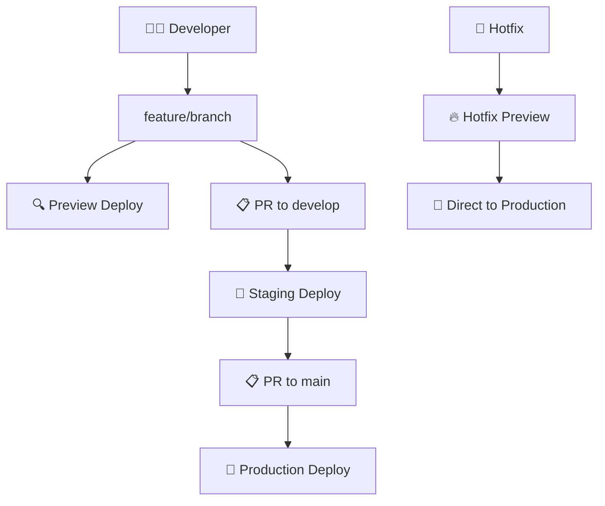

# 🌊 Kuchisabishii Git Flow & Branching Strategy

## 🎯 Branch Structure

### 🎪 Main Branches

#### `main` - Production
- **Environment**: https://kuchisabishii.io
- **Purpose**: Live production code
- **Protection**: Requires PR approval + CI passing
- **Auto-deploy**: ✅ to production

#### `develop` - Staging  
- **Environment**: https://staging-kuchisabishii.vercel.app
- **Purpose**: Integration testing
- **Protection**: Requires CI passing
- **Auto-deploy**: ✅ to staging

### 🌿 Supporting Branches

#### `feature/*` - Feature Development
- **Branch from**: `develop`
- **Merge to**: `develop` via PR
- **Naming**: `feature/food-logging-improvements`
- **Auto-deploy**: ✅ Preview deployments

#### `hotfix/*` - Emergency Fixes
- **Branch from**: `main`
- **Merge to**: `main` AND `develop`
- **Naming**: `hotfix/critical-login-bug`
- **Auto-deploy**: ✅ Hotfix previews

#### `release/*` - Release Preparation
- **Branch from**: `develop`
- **Merge to**: `main` AND `develop`
- **Naming**: `release/v1.2.0`
- **Purpose**: Final testing, version bumps

## 🚀 Deployment Environments



## 📋 Development Workflow

### 🆕 New Feature Development

```bash
# 1. Start from develop
git checkout develop
git pull origin develop

# 2. Create feature branch
git checkout -b feature/recommendation-algorithm

# 3. Make changes and commit
git add .
git commit -m "✨ Improve food recommendation algorithm"

# 4. Push and create PR
git push origin feature/recommendation-algorithm
# Create PR: feature/recommendation-algorithm → develop
```

### 🚨 Hotfix Process

```bash
# 1. Start from main
git checkout main
git pull origin main

# 2. Create hotfix branch
git checkout -b hotfix/login-error-fix

# 3. Fix and test
git add .
git commit -m "🐛 Fix login authentication error"

# 4. Push for preview
git push origin hotfix/login-error-fix

# 5. Create PR to main (after testing preview)
# 6. Merge to develop afterward
```

### 🎯 Release Process

```bash
# 1. Create release branch from develop
git checkout develop
git pull origin develop
git checkout -b release/v1.2.0

# 2. Version bump and final testing
npm version minor
git add .
git commit -m "🔖 Bump version to 1.2.0"

# 3. Merge to main and develop
# PR to main → triggers production deployment
# Merge back to develop
```

## 🔒 Branch Protection Rules

### `main` Branch
- ✅ Require PR reviews (1 reviewer)
- ✅ Require status checks (CI)
- ✅ Require up-to-date branches
- ✅ No direct pushes
- ✅ Include administrators

### `develop` Branch  
- ✅ Require status checks (CI)
- ✅ Require up-to-date branches
- ❌ Direct pushes allowed (for quick fixes)

## 🎨 Commit Message Convention

```
<type>(<scope>): <subject>

<body>

<footer>
```

### Types:
- `✨ feat`: New feature
- `🐛 fix`: Bug fix  
- `📖 docs`: Documentation
- `🎨 style`: Formatting, no code change
- `♻️ refactor`: Code change that neither fixes bug nor adds feature
- `⚡ perf`: Performance improvement
- `🧪 test`: Adding tests
- `🔧 chore`: Maintenance

### Examples:
```bash
git commit -m "✨ feat(food-log): Add emotional rating system"
git commit -m "🐛 fix(auth): Resolve login timeout issue"
git commit -m "📖 docs(api): Update restaurant API documentation"
```

## 🌐 Environment URLs

| Environment | URL | Purpose |
|-------------|-----|---------|
| **Production** | https://kuchisabishii.io | Live app for users |
| **Staging** | https://staging-kuchisabishii.vercel.app | Pre-production testing |
| **Preview** | https://pr-123-kuchisabishii.vercel.app | Feature/PR previews |
| **Hotfix** | https://hotfix-456.vercel.app | Emergency fix testing |

## 📊 CI/CD Pipeline Status

Each environment has automated quality gates:

### ✅ Continuous Integration (All PRs)
- Linting and code formatting
- TypeScript compilation
- Build verification
- Security audit
- Preview deployment

### 🌙 Staging Deployment (develop)
- Full CI pipeline
- Integration testing
- Performance monitoring
- Staging environment refresh

### 🌟 Production Deployment (main)
- Enhanced CI pipeline
- Manual approval gate
- Zero-downtime deployment
- Post-deployment monitoring
- Rollback capability

## 🔧 Setup Commands

```bash
# Clone and setup
git clone https://github.com/Aeternum-Legacy/Kuchisabishii.git
cd Kuchisabishii
git checkout develop

# Install dependencies
cd web && npm install

# Start development
npm run dev

# Create feature branch
git checkout -b feature/your-feature-name
```

---

## 🎯 Quick Reference

**Need to...**
- 🆕 **Add new feature**: Branch from `develop`
- 🐛 **Fix production bug**: Branch from `main` (hotfix)
- 🧪 **Test integration**: Push to `develop`
- 🚀 **Deploy to production**: PR to `main`
- 🔍 **Preview changes**: Any PR gets preview deploy
- 🚨 **Emergency deploy**: Use hotfix workflow

**Questions?** Check the GitHub Actions logs or create an issue!